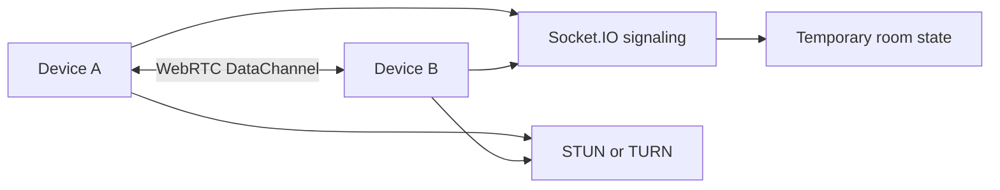

# DropLink

DropLink is an anonymous, temporary room for moving text and files between two devices. It uses WebRTC DataChannels for payloads, Socket.IO only for signaling, and keeps files and chat out of the server.

## Architecture



Rooms use cryptographically random 32-byte tokens plus convenient six-digit display codes. The current local room store is in-memory; Redis is reserved for the production deployment adapter so no file contents are persisted.
Rooms use cryptographically random 32-byte tokens plus convenient six-digit display codes. When `REDIS_URL` is configured, room/session metadata is stored in Redis with TTLs so a backend restart does not invalidate active logical sessions. Without Redis, the app falls back to temporary in-memory state for local development.

Browser refreshes persist only the room ID, participant ID, session token, role, and expiry in local storage. A disconnected participant remains recoverable for `PARTICIPANT_RECONNECT_GRACE_SECONDS`; recovery always creates new WebRTC objects and performs fresh signaling. Files and messages are never placed in browser session storage or Redis.
Redis is available for production-style room storage with `docker compose up -d redis`. If Redis is unavailable during local startup, the server logs a warning and uses temporary in-memory state instead.

## Local setup

Requirements: Node.js 20+ and npm.

```bash
cp .env.example .env
npm install
npm run build
npm run dev
```

The web app runs at `http://localhost:5173` and the server at `http://localhost:3001`. Redis is available for future production-style room storage with `docker compose up -d redis`.

## Environment

See `.env.example` for `PORT`, `CLIENT_URL`, room TTL/participant limits, STUN/TURN settings, and the browser server URL. Never commit real TURN credentials or production secrets.

## Verification

```bash
npm run build
npm run test --workspace @droplink/server
curl http://localhost:3001/api/health
```

The server tests cover secure room generation, expiry, and participant limits. The browser workflow covers room creation/joining, real WebRTC connection, text messages, QR/deep-link joining, and chunked file transfer with backpressure.
The server tests cover secure room generation, expiry, participant limits, session reconnect grace, and invalid session credentials. The browser workflow covers room creation/joining, real WebRTC connection, refresh recovery, text messages, QR/deep-link joining, and chunked file transfer with backpressure.

## Security and privacy model

Rooms expire after inactivity, are limited to two participants, and have IP-based creation/join rate limits. Helmet, CORS, payload limits, input validation, and malformed-room handling protect the HTTP surface. File data and chat travel over the DataChannel; TURN may relay traffic when direct connectivity is unavailable. This is not an absolute anonymity guarantee.

## Production

Build the web workspace for a static host such as Vercel and run the server as a Node.js service behind HTTPS/WSS. Use managed Redis for temporary room metadata and a dedicated TURN service. Set `CLIENT_URL`, secure transport, rate limits, and ephemeral TURN credentials in the deployment environment.

## Known limitations

The local room manager is intentionally in-memory until the Redis adapter is selected for deployment. Browser permissions are required for camera scanning. Very large received files are currently accumulated as Blob chunks; the sender avoids loading the entire file and uses 64 KiB chunks with DataChannel backpressure.
Browser permissions are required for camera scanning. Very large received files are currently accumulated as Blob chunks; the sender avoids loading the entire file and uses 64 KiB chunks with DataChannel backpressure. Redis-backed recovery could not be exercised on this machine because Docker and a local Redis executable are unavailable.
