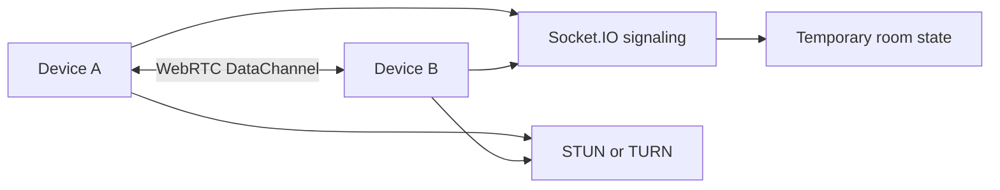

# DropLink

DropLink is an anonymous, temporary room for moving text and files between two devices. It uses WebRTC DataChannels for payloads, Socket.IO only for signaling, and keeps files and chat out of the server.

## Architecture



Rooms use cryptographically random 32-byte tokens plus convenient six-digit display codes. When `REDIS_URL` is configured, room/session metadata is stored in Redis with TTLs so a backend restart does not invalidate active logical sessions. Without Redis, the app falls back to temporary in-memory state for local development.

Browser refreshes persist only the room ID, participant ID, session token, role, and expiry in local storage. A disconnected participant remains recoverable for `PARTICIPANT_RECONNECT_GRACE_SECONDS`; recovery always creates new WebRTC objects and performs fresh signaling. Files and messages are never placed in browser session storage or Redis.
Redis is available for production-style room storage with `docker compose up -d redis`. If Redis is unavailable during local startup, the server logs a warning and uses temporary in-memory state instead.

## Local setup

Requirements: Node.js 20+ and npm.

```bash
cp .env.example .env
npm install
npm run build
npm run dev
```

The web app runs at `http://localhost:5173` and the server at `http://localhost:3001`. Redis is available for production-style room storage with `docker compose up -d redis`.

## Environment

See `.env.example` for `PORT`, `CLIENT_URL`, room TTL/participant limits, STUN/TURN settings, and the browser server URL. Never commit real TURN credentials or production secrets.

## Verification

```bash
npm run build
npm run test --workspace @droplink/server
curl http://localhost:3001/api/health
```

The server tests cover secure room generation, expiry, participant limits, session reconnect grace, and invalid session credentials. The browser workflow covers room creation/joining, real WebRTC connection, refresh recovery, text messages, QR/deep-link joining, and chunked file transfer with backpressure.

## Security & Privacy

- **P2P transfer:** Files and messages use a WebRTC DataChannel between peers where possible. The Express server does not expose file-upload endpoints or write transferred files to disk. A TURN relay may carry network traffic when direct connectivity is unavailable.
- **Temporary server state:** The server stores temporary room membership, participant session tokens, expiration data, and signaling state needed to coordinate connections. Redis keys use TTLs where configured. Room codes are not authorization credentials; protected operations require the participant session token.
- **Anonymous analytics:** The browser creates a random visitor ID and stores it locally. Redis counts that ID once for the aggregate visitor counter. No names, emails, phone numbers, message contents, or file contents are used for the counter.
- **Infrastructure logs:** Hosting, network, security, and infrastructure providers may process technical request and connection information needed to operate the service. DropLink does not intentionally log file contents, message contents, session secrets, authentication tokens, or TURN credentials.
- **Abuse controls:** Helmet security headers, restricted CORS, payload limits, input validation, generic room-code failures, and configurable HTTP/Socket.IO join throttling protect the service. This is not a claim of absolute anonymity or security.

Legal pages are available at `/terms`, `/acceptable-use`, and `/privacy`. Contact details intentionally use the placeholder `YOUR_EMAIL@example.com` until the service owner replaces it.

## Production

Deploy with Render using the included `render.yaml` Blueprint. It defines a Node web service for `apps/server` and a static site for `apps/web`. Set the generated API service URL as `VITE_SERVER_URL` on the static site and the static site URL as `CLIENT_URL` on the API service. Configure managed Redis with `REDIS_URL` and a dedicated TURN service with the TURN variables. Render supplies `PORT` to the API service.

## Known limitations

Browser permissions are required for camera scanning. Very large received files are currently accumulated as Blob chunks; the sender avoids loading the entire file and uses 64 KiB chunks with DataChannel backpressure. Redis-backed recovery requires a configured Redis service.
